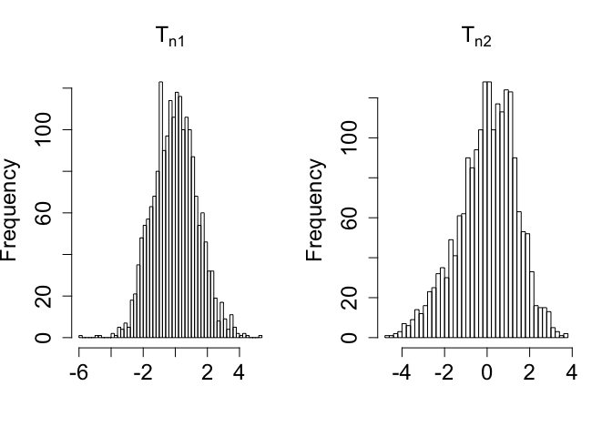

Homogeneity between times for each group
========================================================


If one wants to test the time effect taking out the group and individual effect, the structure of groups and individuals should be preserved. So, for each $b=1,\ldots,B$: 

 1. sample with replacement (w.r.) from the $m_{ig\cdot}$ sequences within each individual ignoring the time structure, i.e., take a sample w.r. of sequences from the pooled sample of sequences from each individual combining times. The first $m_{ig1}$ sequences will be from time 1, the second $m_{ig2}$ from time 2 and so on.
2. compute the vector $\mathbf{B}_{nb} = (BT_{1_b}, BT_{2_b}, \ldots , BT_{Gb})$ for each $b=1, \ldots B$.
3. standardize each $BT_{g_b}$ ($g=1, \ldots , G$), i.e., subtract the mean and standard deviation of the $B$ values of $BT_{g_b}'s$. 
4. compute the appropriate $\mathbf{T}_{nb}=\mathbf{C}\mathbf{B}_{nb}$.

The code for this procedure is:


```r
if (!file.exists("./data/DataBoot.rda"))
  {
load("./data/AllSeqNew.rda")
load("./data/DataInfoNew.rda")

DataBoot <- DataInfoNew[,c("Group","Patient","Visit")]
tmp <- unique(DataBoot[,c("Group","Patient")])
B=2000
IndexBoot <- matrix(NA,ncol=B,nrow=dim(DataInfoNew)[1])
set.seed(2014)

  for (b in 1:B)
     {
          tmpIndexBoot <- c()
          for (i in 1:dim(tmp)[1])
              {
                  index <- which(DataInfoNew$Group==tmp[i,"Group"] &
                                 DataInfoNew$Patient==tmp[i,"Patient"])
                  if (length(index)>1)
                      {
                          tmpIndexBoot <- sample(index,replace=TRUE)
                      }
                  else
                      {
                          tmpIndexBoot <- index
                      }
           IndexBoot[index,b] <- tmpIndexBoot
              }
      }

DataBoot$IndexOriginal <- 1:dim(DataBoot)[1]
DataBoot <- cbind(DataBoot,IndexBoot)
save(DataBoot,file="./data/DataBoot.rda")
}
```

After generating all boostrap indexes, we need to compute the statistics for each bootstrap sample.


```r
if (!file.exists("./data/Rboot.rda"))
{
load("./data/AllSeqNew.rda")
load("./data/DataInfoNew.rda")
load("./data/DataBoot.rda")

library(ape)

IndexOrig=DataBoot[,4]
SequenceMatrix <- AllSeqNew[IndexOrig,]

AllDistances <- as.matrix(dist.gene(SequenceMatrix,method="percentage",pairwise.deletion=TRUE))

source("./function/distances.R")

Rboot <- list()
B <- dim(DataBoot)[2]-3
# checking if the group/visit label are in the same order
  DataBoot$Group==DataInfoNew$Group # should be true
  DataBoot$Visit==DataInfoNew$Visit # should be true

for (b in 1:B)
    {
        Rboot[[b]] <- distances(AllDistances=AllDistances,Group=DataBoot$Group,Time=DataBoot$Visit,Index=DataBoot[,b+3])
      }

save(Rboot,file="./data/Rboot.rda")
}
```

We now calculate $\mathbf{B}_n=(BT_1,BT_2,BT_3)$ for the original sample and the bootstrap samples.

$BT_g=\sum_{t<t'}\frac{m_{.gt}m_{.gt'}}{N(N-1)}(2\bar{R}_{gt;gt'}-\bar{R}_{gt;gt}-\bar{R}_{gt';gt'})$, $g=1,\ldots, 3$ for testing the homogeneity of time (1 and 2) for each group (P, SP, RP).


```r
load("./data/Rboot.rda")
load("./data/DataBoot.rda")

tmp <- as.data.frame(table(DataBoot$Group))
minSeq <- which(tmp$Freq==min(tmp$Freq))
n <- tmp$Freq[minSeq]
```


```r
if(! file.exists("./data/BTg.rda"))
  {
  groups <- unique(DataBoot$Group)
  time <- unique(DataBoot$Visit)

  g <- expand.grid(groups,time) # always use groups and time in this order (keep same order as used in distances.R
  colnames(g) <- c("groups","time")

  BTg <- matrix(NA,ncol=length(groups),nrow=length(Rboot))

  #library(combinat)

  for (b in 1:length(Rboot))
      {
          N <- dim(DataBoot)[1] # total number of sequences
          Migt <- Rboot[[b]]$Migt # m.gt
          R <- Rboot[[b]]$R

          for (j in 1:length(groups))
              {
                  d <- c()
                  tmp <- as.character(g[g[,1]==groups[j],2])
                  aa <- as.matrix(combn(tmp,2),nrow=2) # all pairwise combination of the groups

                  d <- apply(aa,2,function (x)
                                        {
                                            tmp1 <- which(g[,1]==groups[j] & g[,2]==x[1])
                                            tmp2 <- which(g[,1]==groups[j] & g[,2]==x[2])
                                            rr <- Migt[tmp1]*Migt[tmp2]*(2*R[tmp1,tmp2]-R[tmp1,tmp1]-R[tmp2,tmp2])
                                            return(rr)
                                        }
                             )
                 BTg[b,j] <- sum(d)/(N*(N-1))
              }
      }
  colnames(BTg) <- c("P","RP","SP")

  save(BTg,file="./data/BTg.rda")
  
}
```


```r
load("./data/BTg.rda")

# p-values

pvP <- round(length(which(BTg[-1,1]>BTg[1,1]))/(length(Rboot)-1),3)
pvRP <- round(length(which(BTg[-1,2]>BTg[1,2]))/(length(Rboot)-1),3)
pvSP <- round(length(which(BTg[-1,3]>BTg[1,3]))/(length(Rboot)-1),3)
```

 


 


We then calculate $\mathbf{T}_n=\mathbf{C}\mathbf{B}_n$. First, we standardize each $BT_g$.


```r
Tn1 <- (BTg[,"P"]-mean(BTg[,"P"]))/sd(BTg[,"P"]) - (BTg[,"SP"]-mean(BTg[,"SP"]))/sd(BTg[,"SP"]) 
Tn2 <- (BTg[,"P"]-mean(BTg[,"P"]))/sd(BTg[,"P"]) - (BTg[,"RP"]-mean(BTg[,"RP"]))/sd(BTg[,"RP"])
Tn <- cbind(Tn1,Tn2)
save(Tn,file="./data/Tn.rda")
```

 

 


From the data set we compute the observed value of $\mathbf{B}_n$ and $\mathbf{T}_n$, call them $\mathbf{B}_{n obs}$ and $\mathbf{T}_{n obs}$. Compute the p-value as $(\#\mathbf{T}_{nb} >\mathbf{T}_{n obs})/B$. 
  
Next, we calculate $\cal{L}_n$.

```r
load("./data/Tn.rda")
source("./function/Ln.R")
Ln
```

```
## function (Tn = Tn, n = n) 
## {
##     B <- dim(Tn)[1]
##     r <- expand.grid(rep(list(c(0, 1)), dim(Tn)[2]))
##     t <- apply(r, 1, sum)
##     r <- r[-which(t == 0 | t == dim(Tn)[2]), ]
##     Ln <- matrix(NA, ncol = 1, nrow = B)
##     for (b in 1:B) {
##         gg <- c()
##         Sna_aap1 <- cov(Tn)
##         for (i in 1:dim(r)[1]) {
##             tmp <- which(r[i, ] == 1)
##             if (length(tmp) > 0 & length(tmp) < dim(Tn)[2]) {
##                 Tna <- matrix(Tn[, tmp], ncol = length(tmp))
##                 Tnap <- matrix(Tn[, -tmp], ncol = (dim(Tn)[2] - 
##                   length(tmp)))
##                 Snaa <- cov(Tna)
##                 Snaap <- cov(Tna, Tnap)
##                 Snapa <- t(Snaap)
##                 Snapap <- cov(Tnap)
##                 Sna_aap <- Snaa - Snaap %*% solve(Snapap) %*% 
##                   Snapa
##             }
##             Tna_ap <- Tna[b, ] - Snaap %*% solve(Snapap) %*% 
##                 Tnap[b, ]
##             tt <- ifelse(Tna_ap > 0, 1, 0)
##             vv <- ifelse(solve(Snapap) %*% Tnap[b, ] <= 0, 1, 
##                 0)
##             Ina <- ifelse((sum(tt) + sum(vv)) == (length(tt) + 
##                 length(vv)), 1, 0)
##             gg <- append(gg, (n * n) * Ina * t(Tna_ap) %*% solve(Sna_aap) %*% 
##                 Tna_ap)
##         }
##         Tna_ap1 <- Tn[b, ]
##         tt1 <- ifelse(Tna_ap1 > 0, 1, 0)
##         Ina1 <- ifelse(sum(tt1) == length(tt1), 1, 0)
##         Ln[b] <- sum(gg) + (n * n) * Ina1 * t(Tna_ap1) %*% solve(Sna_aap1) %*% 
##             Tna_ap1
##     }
##     return(Ln)
## }
```

```r
Ln1 <- Ln(Tn,n)  
Ln1[1] # Ln Obs
```

```
## [1] 8925.831
```

```r
pvLn <- round(length(which(Ln1[-1]>Ln1[1]))/(length(Ln1)-1),3)
```


```r
hist(Ln1,breaks=100,main=bquote(atop(L[n],"p-value"==.(pvLn))),xlab=" ",cex.lab=1.5,cex.axis=1.5,cex.main=1.5,prob=TRUE)
abline(v=Ln1[1],col="red")
```

 


