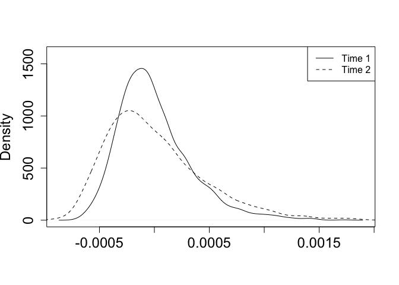
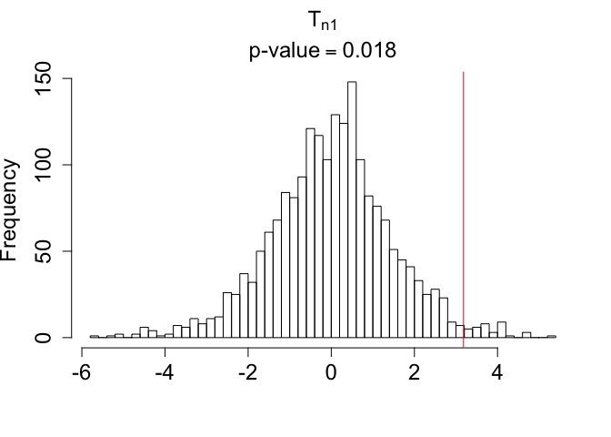
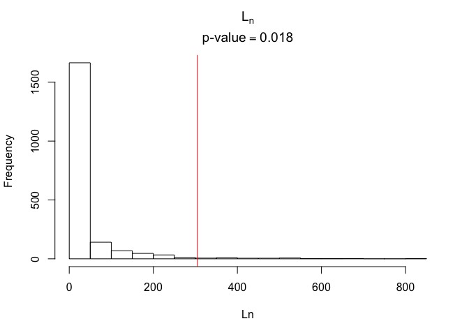

Homogeneity between groups for each time - Q45
========================================================

For *Woman Q45*, we may test homogeneity of groups for each time  (dates: 8/93, 10/94), i.e., we compute $BG_t, t=1, 2$. Then, we can test if the homogeneity of groups is the same for all times using  $\mathbf{T}_n=\mathbf{C}\mathbf{B}_n = (T_{n1})$, with $\mathbf{B}_n = (BG_1, BG_2)$ and 
\[ \mathbf{C} = \left ( \begin{array}{cc}
-1 & 1 
\end{array} 
\right ) . 
\]


If one wants to test the group effect taking out the time effect, the structure of times should be preserved. So, for each $b=1,\ldots,B$: 

 1. sample with replacement (w.r.) from the $m_{i\cdot g}$ sequences (i.e., the total number of sequences for individuals $i$ at time $t$) ignoring the group structure. For each time, the first $m_{i1t}$ sequences will be from group 1, the second $m_{i2t}$ from group 2 and so on.
2. compute the vector $\mathbf{B}_{nb} = (BG_{1_b}, BG_{2_b}, \ldots , BG_{Tb})$ for each $b=1, \ldots B$.
3. standardize each $BG_{t_b}$ ($t=1, \ldots , T$), i.e., subtract the mean and standard deviation of the $B$ values of $BG_{t_b}'s$. 
4. compute the appropriate $\mathbf{T}_{nb}=\mathbf{C}\mathbf{B}_{nb}$.

The code for this procedure is:


```r
if (!file.exists("./data/DataBootQ45.rda"))
  {
  load("./data/AllSeqNew.rda")
  load("./data/DataInfoNew.rda")
  
  DataInfoNewQ45 <- DataInfoNew[DataInfoNew$Patient=="Q45",]
  AllSeqNewQ45 <- AllSeqNew[DataInfoNew$Patient=="Q45",]
  
  save(DataInfoNewQ45,file="./data/DataInfoNewQ45.rda")
  save(AllSeqNewQ45,file="./data/AllSeqNewQ45.rda")


  DataBoot <- DataInfoNewQ45[,c("Group","Patient","Visit")]
  tmp <- unique(DataBoot[,c("Patient","Group","Visit")])
  B=2000
  IndexBoot <- matrix(NA,ncol=B,nrow=dim(DataInfoNewQ45)[1])
  set.seed(2014)
  for (b in 1:B)
      {
          tmpIndexBoot <- c()
          for (i in 1:dim(tmp)[1])
              {
                  index <- which(DataInfoNewQ45$Visit==tmp[i,"Visit"] &
                                 DataInfoNewQ45$Patient==tmp[i,"Patient"])
                  if (length(index)>1)
                      {          
                          tmpIndexBoot <- sample(index,replace=TRUE)
                      }
                  else
                      {
                          tmpIndexBoot <- index
                      }
                  IndexBoot[index,b] <- tmpIndexBoot
              }
      }
  DataBoot$IndexOriginal <- 1:dim(DataBoot)[1]
  DataBoot <- cbind(DataBoot,IndexBoot)
  save(DataBoot,file="./data/DataBootQ45.rda")
  }
```

After generating all boostrap indexes, we need to compute the statistics for each bootstrap sample.


```r
if (!file.exists("./data/RbootQ45.rda")) {
  load("./data/AllSeqNewQ45.rda")
  load("./data/DataInfoNewQ45.rda")
  load("./data/DataBootQ45.rda")
  library(ape)
  
  
  IndexOrig=DataBoot[,4]
  SequenceMatrix <- AllSeqNewQ45[IndexOrig,]
  
  AllDistances <- as.matrix(dist.gene(SequenceMatrix,method="percentage",pairwise.deletion=TRUE))
  
  source("./function/distances.R")
  
  Rboot <- list()
  B <- dim(DataBoot)[2]-3
  # checking if the group/visit label are in the same order
  DataBoot$Group==DataInfoNewQ45$Group # should be true
  DataBoot$Visit==DataInfoNewQ45$Visit # should be true
  
  for (b in 1:B) {
    Rboot[[b]] <- distances(AllDistances=AllDistances,Group=DataBoot$Group,Time=DataBoot$Visit,Index=DataBoot[,b+3])
    
  }
  
  save(Rboot,file="./data/RbootQ45.rda")
}
```

We now calculate $\mathbf{B}_n=(BG_1,BG_2,BG_3)$ for the original sample and the bootstrap samples.

$BG_t=\sum_{g<g'}\frac{m_{.gt}m_{.g't}}{N(N-1)}(2\bar{R}_{gt;g't}-\bar{R}_{gt;gt}-\bar{R}_{g't;g't})$, $t=1,2,3$ for testing the homogeneity of groups (Plasma, PBMC and Cervical) at each time.


```r
load("./data/RbootQ45.rda")
load("./data/DataBootQ45.rda")

tmp <- as.data.frame(table(DataBoot$Group))
minSeq <- which(tmp$Freq==min(tmp$Freq))
n <- tmp$Freq[minSeq]

if(! file.exists("./data/BGt45.rda"))
  {
  groups <- unique(DataBoot$Group)
  time <- unique(DataBoot$Visit)

  g <- expand.grid(groups,time) # always use groups and time in this order (keep same order as used in distance.R
  colnames(g) <- c("groups","time")

  BGt <- matrix(NA,ncol=length(time),nrow=length(Rboot))

  library(combinat)

  for (b in 1:length(Rboot))
      {
          N <- dim(DataBoot)[1] # total number of sequences
          Migt <- Rboot[[b]]$Migt # m.gt
          R <- Rboot[[b]]$R
          GroupTime <- Rboot[[b]]$GroupTime

          for (j in 1:length(time))
              {
                  d <- c()
                  tmp <- as.character(g[g[,2]==time[j],1])
                  aa <- combn(tmp,2) # all pairwise combination of the groups

                  d <- apply(aa,2,function (x)
                                        {
                                            tmp1 <- which(Migt[,2]==time[j] & Migt[,1]==x[1])
                                            tmp2 <- which(Migt[,2]==time[j] & Migt[,1]==x[2])
                                            
                                            group1time <- paste(x[1],time[j],sep="|")
                                            group1timegroup1time <- paste(group1time,group1time,sep="_")

                                            group2time <- paste(x[2],time[j],sep="|")
                                            group2timegroup2time <- paste(group2time,group2time,sep="_")

                                            group1timegroup2timeA <- paste(group1time,group2time,sep="_")
                                            group1timegroupp2timeB <- paste(group2time,group1time,sep="_")
                                            
                                            tmp3 <- which(GroupTime %in% c(group1timegroup2timeA,group1timegroupp2timeB),arr.ind=TRUE)
                                            tmp4 <- which(GroupTime %in% group1timegroup1time,arr.ind=TRUE)
                                            tmp5 <- which(GroupTime %in% group2timegroup2time,arr.ind=TRUE)
                                            
                                            rr <- Migt[tmp1,3]*Migt[tmp2,3]*(2*R[tmp3]-R[tmp4]-R[tmp5])
                                            return(rr)
                                        }
                             )
                 BGt[b,j] <- sum(d)/(N*(N-1))
              }
      }
  colnames(BGt) <- time

  save(BGt,file="./data/BGtQ45.rda")
}
```


Empirical distribution of $BG_t$:


 


Empirical distribution of $BG_t$:

 


We then calculate $\mathbf{T}_n=\mathbf{C}\mathbf{B}_n$. First, we standardize each $BG_t$.


```r
Tn1 <- (BGt[,2]-mean(BGt[,2]))/sd(BGt[,2]) - (BGt[,1]-mean(BGt[,1]))/sd(BGt[,1])
Tn <- as.matrix(Tn1,ncol=1)
pvTn1 <- round(length(which(Tn1[-1]>Tn1[1]))/(length(Rboot)-1),3)


save(Tn,file="./data/Tn_Q45.rda")
```

 


```r
Tt <- (Tn1-mean(Tn1))/sd(Tn1)
varTn1 <- var(Tn1)
Ln <- ifelse(Tn1>0,(n*n*Tn1*Tn1)/varTn1,0)
pvLn2 <- round(length(which(Ln[-1]>Ln[1]))/(length(Ln)-1),3)
```
The observed $\cal{L}_n$ is 304.58.

Empirical distribution of $\cal{L}_n$:

 


